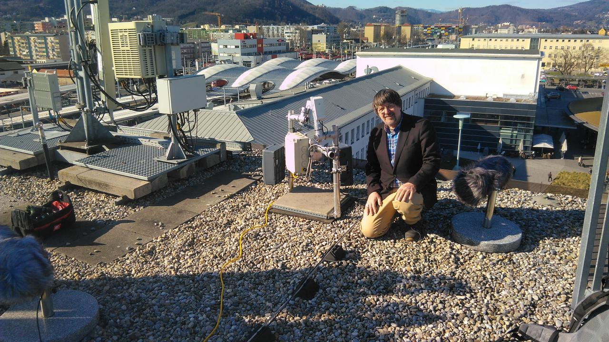
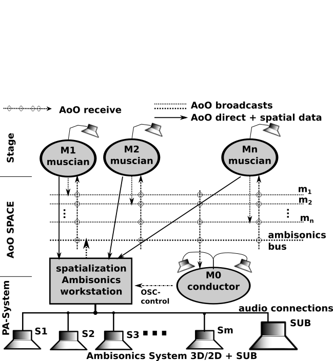
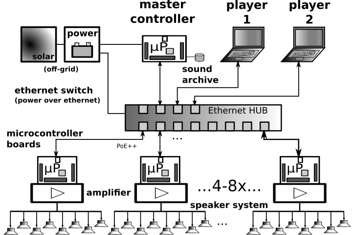
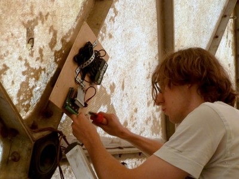
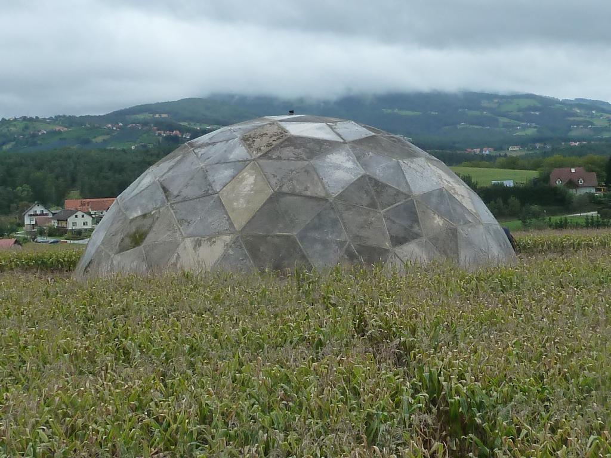

=========================================
AOO - Use Cases 
=========================================
towards message based audio systems
-----------------------------------

Use Cases was the driving motor for development of AoO. Here the important Project shown as use cases, to illustrate the usages and detect the drawbacks of this streaming solutions.

Here historic Implementation are also shown.

virtual concert hall and rehearsal rooms
========================================

.. figure:: ./figures/aoo_vrr.png
   :alt: ICE using AoO as space for playing together and on a PA system
   :width: 95%

   Musicians using AoO as rehearsal space for playing together with conductor and binaural rendering

See VRR_ homepage dokumentation [VRR_DOKU] for further info.
 
.. _VRR: http://vrr.iem.at/

 

.. [VRR_DOKU] http://vrr.iem.at/docs/vrr

stream boxes  
============

A reference project can be found at IEM git server, which is the realisation of streams for Bill Fontana just exploring in Graz:

- http://git.iem.at/cm/DIYasb

.. _fig-diyasb:

   weather-proof streaming boxes on a rooftop with directional microphones

Doku: To be done... there and here

Playing together on stages
==========================

.. .. centered::

.. _fig-ice_playing:

.. figure:: ./images/ice_porgy_and_bess_small.jpg
   :alt: first concert of IEM computermusic ensemble ICE playing over a HUB
   :width: 90%

   first concert of IEM computermusic ensemble ICE playing over a HUB

When specifying an audio-network for playing together within an ensemble, a focus was set on the collaborating efforts to be done to gain the unity of the individuals.

So, like a musicians with acoustic instrument, joining a band with Linux audio-computer implies a need for a place where the musician has a ”virtual sound space“ they can join. So they provide sound sources and need to plugin audio channels on a virtual mixing desk. With AoO the participant just needs to connect to the network, wireless or wired, choosing the sinks to play to and send phrases of audio with AoO when needed.

For the ICE ensemble Ambisonics as an virtual audio environment was chosen, which can be rendered to different concert halls. Within the Ambisonics each musician can always use the same playing parameters for spatializing her or his musical contribution. So the imagination of the musician is ”playing in a virtual 3D environment“, sending their audio signals together with 3D-spatial data to a distributed mixing system which is rendering it on the speakers.

Additional there is an audio communication between the musicians, where each musicians can hear into the signal produced by the other, if there is one or on special offered sinks send audio intervention to the others for e.g. monitoring purposes. The musicians can do their own monitor mix, depending on the piece and space where the play.

Using a message audio system, each musicians only sends sound data if playing, like audio bursts just notes, or just sending their audio-data to another musicians, who will process this further and so on. There should be no border on the imagination of these situations, (as long it can be grasped by the participants).

.. .. centered::

.. _fig-aoo_ice:

   ICE using AoO as space for playing together and on a PA system

.. raw:: latex

   \clearpage
   
message based Ambisonics spatial audio systems
==============================================

.. .. centered::

.. _fig-aoo_embedded:

   AoO with embedded devices for spatial audio system

As a first goal, the geodesic sound-dome in Pischelsdorf (with a diameter of 20 m and a height of about 10 m) as an environmental landscape sculpture in Pischelsdorf should transmute into 3D a sound-sphere. Therefore as special hardware and software, a low power solar power driven multichannel Ambisonics system was developed and installed prototypically. This should result in a low cost implementation of multichannel audio system Up to 48 speakers should be mounted in a hemisphere, forming an Ambisonics sound system. Using 6 nodes, each with 8 speakers, special embedded controllers are used to render the audio in the system

.. .. centered::

.. _fig-aoo_domespeaker:

   One node for 6 channels with one speaker in the dome

Each node is a small embedded computer equipped with an 8-channel sound-card, including amplifiers and speakers. Each speaker can been calibrated and fed individually. However, since each unit is aware of its speaker positions, it can also render the audio with an internal Ambisonics encoder/decoder combination.

So instead of sending 48 channels of audio to spatialize one or more sources, the sources can be broadcast combined with OSC-spatialization data and the sinks render them independently. Another possibility is to broadcast an encoded Ambisonics-encoded multichannel signal, where the devices decode the Ambisonics signal for their subset of speakers. The Sound Environment can be sent from one master controller or any other connected computer.

The first implementation of the nodes has been done with special micro-controller boards escher2 which drive the custom designed DA-Amp boards. Since these devices have very limited memory (max. 16 samples of 64 channels), standard Linux audio system cannot provide the packets small and fast enough for a stable performance without special efforts, like own driver in kernel space for the packet delivery. Therefore a major problem has been the synchronization and the reliability of the transmission, but providing latency.

.. .. centered::
.. _fig-aoo_dome:

   sounddome as hemisphere, 20 m diameter in cornfield

The main advantage, besides the low cost and autonomous system, is that one or more sound technicians or computer musicians can enter the dome, plug into the network with their portable devices and play the sound dome either addressing speakers individually, with audio material spatializing live with additional OSC messages or a generated or prerecorded Ambisonics audio material.

.. raw:: latex

   \clearpage

state of the work
=================

to be written...

The AoO has been implemented for proof of concept and special
applications in a first draft version. The next version should fixate
the protocol, after having discussed it in public, in a way that makes
it compatible with future protocol upgrades.

.. The usage of AoO in an ensemble has been explored in a workshop with
.. students at the IEM, but the implemented software was not stable enough
.. on the different platforms used for stage performance. This was
.. especially true, when we tried to reach the short latencies needed for
.. concerts. Some more programming efforts has to be done, to guarantee
.. better timing using different computer types, within different
.. Linux-implementations and setups.
.. 
.. Running AoO on embedded Linux devices has shown to be successful, if the
.. devices are tweaked for real-time audio usage. The development on the micro-controller board has been abandoned in favor of
.. the new generation of small low power embedded devices with arm
.. processors. A first version of implementation (V1.0) of AoO is scheduled
.. for April 2014 for a public installation in the sound-dome, where the
.. Ambisonics audio-system should be finalized for permanent performance
.. and open access. More documentation and source code should be released
.. and open-hardware as AoO-audio devices should be available.
.. 

Special focus will be done in future on using embedded devices with AoO as networked multichannel audio hardware interfaces for low cost solutions adding audio processing for calibration filters, beam-forming,…for
speaker-systems optional powered over Ethernet.

Acknowledgements
================

Thanks to …my colleagues on the IEM supporting me with their help,
especially Wolfgang Jäger for a first implementation as a
sound-engineering project. Also for helping set up the ”Klangdom“
especially to Marian Weger, Matthias Kronlachner and the cultural
initiative K.U.L.M. in Pischelsdorf and the members of the ICE Ensemble
helping to experiment and many others. Thanks also for corrections of
this doku and useful hints, to enhance the understanding.

Conclusions
===========

Starting as a vision, these experiments and implementations have shown, that message based audio systems can enhance the collaboration in ensembles, playing open audio systems. Also network art projects using the Internet can use AoO to contribute to sound installation from outside, just knowing the IP and ports to use.

With Version~2.0 a usable system has been created and tested und hopfully with the input of the community will further enhance.

.. The implementation is far from being complete, and more restrictions
.. will be included in order to simplify the system. Synchronization and
.. re-sampling is not perfect, but usable for most cases and it has been
.. shown, that audio message systems can work reliable in different
.. situations.

.. Audio message systems can also be implemented in other formats than OSC
.. and lower layers of the Linux OS, like jack-plugins or ALSA-modules as
.. converters between message based audio system and synchronous data flow
.. models.
.. 
.. For really low latency (below 1 ms) using AoO as audio over Ethernet
.. system, kernel-drivers must be developed and with time-slotted Ethernet
.. transmissions, systems with latencies down to 8 us on transmission time
.. can be implemented using hard RT-systems.

.. [Pd96] Miller S. Puckette, "Pure Data",
	in "Proceedings, International Computer Music Conference." p.224–227,
        San Francisco, 1996
